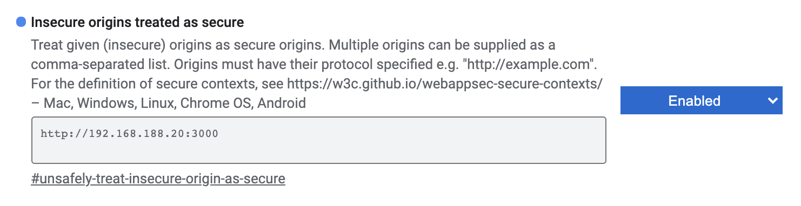
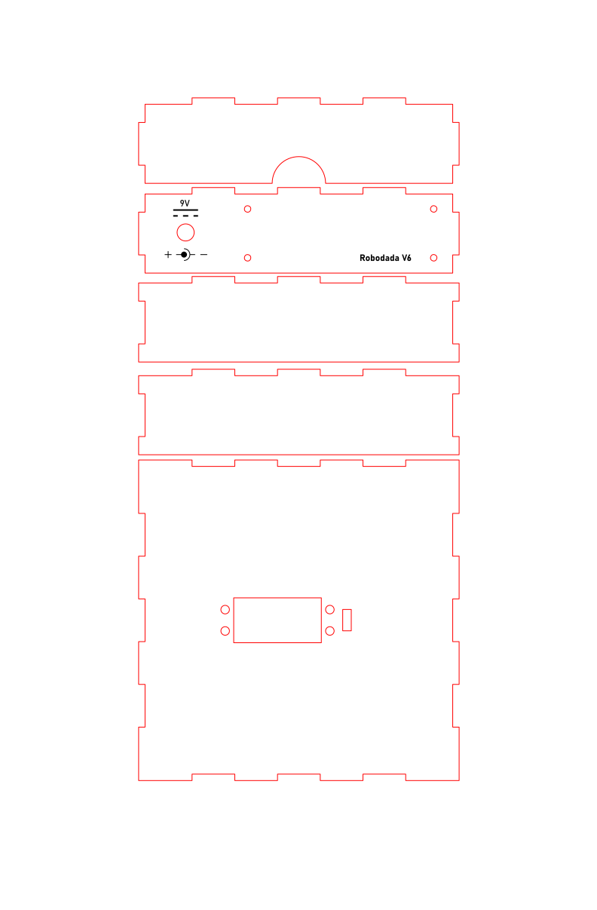

# ROBODADA > Logo Here

## Table of Contents
* [What is ROBODADA?](#what-is-robodada)
* [Requirements](#requirements)
    * [Nice to have](#nice-to-have)
* [Installation](#installation)
* [Startup](#startup)
* [How to use](#how-to-use)
* [Multi-user support](#multi-user-support)
* [Build your own Robot](#build-your-own-robot)
    * [Pan/Tilt module](#dagurobot-pantilt-module)
    * [Servostand](#servostand)
    * [Circuit board](#circuit-board)
        * [Building the board](#building-the-board)
        * [Flashing the Robot](#flashing-the-robot)
        * [Put it all together](#put-it-all-together)
        * [Powering up your Robot](#powering-up-your-robot)
        * [Good to know](#good-to-know)
* [Team](#team)
* [Credits](#credits)
* [License](#license)
## What is ROBODADA?

__kurzer Walkthrouhg hier (select motion, record motion, emotion detection to motion robot max. 10 Sekunden)__

ROBODADA is an open-source toolkit to map facial expressions to body language of a robot. By adapting appearance and kinetic behavior, different aspects of interaction with emotion-aware robots can be explored in a playful manner.

A web-based interface allows you to move a two-axis robot, record different motion patterns and assign them to the seven basic emotions by [Ekman](https://www.researchgate.net/publication/318447136_Basic_Emotions). When you activate your webcam, ROBODADA tries to interpret your emotion based on a pretrained model for face expression and selects the corresponding motion pattern of the robot. We use the [face-api.js API](https://github.com/justadudewhohacks/face-api.js/) for face expression detection. We are aware, that machine based emotion detection has to be critically [discussed](https://www.theverge.com/2019/7/25/8929793/emotion-recognition-analysis-ai-machine-learning-facial-expression-review). ROBODADA underlines, that a machine is not really able to detect emotions, it just tries to classify features of [face landmarks](https://github.com/justadudewhohacks/face-api.js/#models-face-landmark-detection) through a pretrained model. The system just makes decisions on values, which can be measured.

We see ROBODADA as a playful approach for further discussion:
* How does a machine actually sees us?
* How do we interpret the behaviour of a machine?
* How is a machine’s behaviour affecting our behaviour?
* ...


Our goal is to offer a tool as simple as possible, no coding skills are required. The simple robot module offers endless possibilites to add different analog materials and extensions. ROBODADA also provides multi-user and robots support in a local network running on just one server. Users of the web interface do not need to install any packages or hardware drivers. Just browse to the server, find your robot and perform it.

Our server is implemented with [Node.js](https://nodejs.org), interface elements and emojis are based on [OpenMoji](https://openmoji.org/). For the hardware part we use NodeMCU ESP8266 modules to control the robots via OSC (Open Sound Control) wirelessly over the local network.

## Requirements
To use ROBODADA as a single user you need:
* [Node.js](https://nodejs.org/en/download/) with npm
* Laptop/Computer with Webcam (tested on Windows and MacOS)
* Firefox or Chrome

### Nice to have
* a robot (everything is nicer with a robot, isn't it?)

## Installation
First of all you need to install Node.js from [here](https://nodejs.org/en/download/). We recommend using the installer.

Check your working Node.js installation by opening your terminal and type
```shell
node --version
```
which should show something like `v12.18.3`.
If your terminal tells you `Command not found` or similar, something went wrong with your Node.js Installation.

Download the ROBODADA archive from [here](https://github.com/HybridThingsLab/robodada/archive/master.zip) and unzip it to a suitable directory. There will be a folder called `robodada-master`.

Next, we will install the neccessary packages: Go __with your terminal__ inside the `robodada-master` folder and into the folder `Serverland`. In this folder you see things like `app.js` and `package.json`.
The following command will automagically install all the needed things for you, while amazing you with nice terminal animations:
```shell
npm install
```

## Startup
After a successful installation, again __with your terminal__ and inside the folder `robodada-master/Serverland` start the server with this command:
```shell
node app.js
```
The server is starting up, telling you:
```shell
Searching robots on <Your interface and ip here>
Listening on 3000 in <Your Path>robodada-master/Serverland/controller
```
It will search robots every few seconds - so don't mind the messages. Congratulations! This wasn't too hard, was it?
If no "real" robot is connected to the network or you still have to build one, there is a robot simulation view available, see next part [How to use](#how-to-use).


## How to use
Take your favourite browser, we recommend Firefox and Chrome and go to [localhost:3000](localhost:3000).

* choose your robot icon top-left 🤖 and connect 🤝
* choose an emotion 🤢, 😥, 😧, 😐, 😄, 😡, 😯
* draw motion path ✏️
* set loop mode on/off ▶️
* you can save or load motion paths using the icon top-right 💾
* activate webcam 📸

If there is no "real" robot connected we offer a simulation of the two-axis module. Press __'F2'__ to open view.

## Multi-user support
To access the webinterface and server from another machine in the local network use the IP and port number of the machine running the server. For example ```http://192.168.188.22:3000```

Right now we have some issues to access the webcam if not running on localhost. For now this can be fixed in the settings of your webbrowser. For example in Chrome open ```chrome://flags/``` and add IP & port of the machine running the server.



## Build your own Robot
_image of robots_

So you decided to build your own robot - in the future this will be done by robots for you but until then you have to do it yourselves.

We assume that you have worked with [Arduino](https://www.arduino.cc/) or similar in the past and __you know what you are doing__ when plugging in soldered stuff into your beloved Laptop/Computer.

The robot we will build is just a proposal, and you can modify it in any way you like. [Let us know](mailto:robodada@hybridthings.com) when you did something cool!

You will build three main components:
* a servo pan tilt module (we recommend modules from [DaguRobot](http://www.dagurobot.com/Sensor_pan_tilt_kit_DGS3003_servo?search=pan%20tilt&category_id=0))
* a lasercut stand for the servos
* a soldered PCB board which will hold the microcontroller and connects to the servos

Additionally to the items listed in the components you will need:
* 8x M3 bolts, 16mm
* 16x M3 washers
* 4x distance ring M3, 5mm, non-conductive
* wire
* 2x wire terminator
* barrel plug female, 5.0-2.5, for 3mm panel installation
* power supply 6V to 9V direct current, >=1500mW, barrel plug male, 5.0-2.5, the power rail at the connectors pin and ground at the ring


### Pan/Tilt module


We recommend [this](http://www.dagurobot.com/Sensor_pan_tilt_kit_DGS3003_servo?search=pan%20tilt&category_id=0) module from DaguRobot. You will find it at your favourite distributor over the internet. __Make sure you get the long version!__
Build the module as described in the manual. When fixing the servo hubs, mount them in a position that the servers are in a __50% position__ when pointing upright/centered.

### Servostand
|||
|-|-|
|SVG file|Cutting|
|||
|Parts|Build the stand|
|||


Our servostand is a lasercut stand which will perfectly fit the pan/tilt module and has fixing holes for the PCB and power connector.
You can cut it out of a __3mm__ thick material of your choice - we recommend MDF board or something similar, non-conductive, glueable.
 
### Circuit board

|Top|Bottom|With NodeMCU|
|-|-|-|
||||

The circuit board holds the electric heart of your robot: a NodeMCU wireless controller (free the robots!). Additionally it provides a voltage converter and a (huge) capacitor to provide the servos with power, while supporting a wide range of input voltages. It also has mounting holes and a terminal connector for the powerboard too keep everything organized.

#### Building the board


To build the circuit you need:
* NodeMCU ESP8266
* breadboard 100mm x 33mm, 2.54 grid
* 2x connector strip female, 1x15
* 1x connector strip male, 2x3
* voltage converter L7805
* capacitor 3300uF, 16V
* screw terminal block 2 pin
* wire

We use a breadboard, labeled on the top side and cut with a lasercutter. Make sure you hit the board on its holes when labeling your conductor paths with a lasercutter. Drill 3mm holes at the correct positions.

Solder the board as shown in the diagram. Start with the wire for the long connections, then add the other components.

#### Flashing the Robot

We do this with the Arduino software. Don't worry - it's straight forward.

Before programming the robot, you need to add the board to the Arduino's board library and do some minor configurations. It is well documented [here](https://www.instructables.com/id/Setting-Up-the-Arduino-IDE-to-Program-the-ESP8266-/).

You also need to add the [ArduinoOSC](https://github.com/hideakitai/ArduinoOSC) library.

After setting up your Arduino environment, go to ```robodada-master/Roboland/NodeMCU_ESP8266/osc_servo``` and open up the ```osc_servo.ino``` file with your Arduino programming environment. You will notice that the patch consists of two files: beside the ```osc_servo.ino``` there is also a ```config.h```.

Open the ```config.h``` and fill the following information:
```cpp
#define ROBO_NAME "Bender"

#define SSID_NAME "name of your WiFi"
#define PWD "password of your WiFi"
```

* ROBO_NAME: name of your robot, choose wisely, __if you use multiple robots, names must be unique__
* SSID_NAME: as your robot connects via WiFi it has to know your credentials. This one is the name/ssid of your WiFi.
* PWD: the secret of your WiFi

Save your changes and upload the patch to your NodeMCU. Your Arduino Software should show the upload progress and something like "completed" in the end. If it does not finish/start the upload, most probably something went wrong with the NodeMCU driver installation or the board configuration.

### Put it all together
Nearly there..

Solder two cables (6cm) to your power connector, isolate, and seal the open ends by soldering or crimping sleeves.
Fix your power connector in the prepared mounting hole in the servostand.

Fix your circuitboard with M3 screws and washers in the four holes inside the servostand. Add a distance ring between the stand and the board. Connect the power connector to the terminal of the board. __Take care of the polarity!__

Fix the pan/tilt module in the stand with M3 screws and washers. Guide the servocables through the holes and connect them to the board. Again: __Care the polarity!__ You don't want to fry your robots limbs at the first powerup.

### Powering up your Robot
Congratulations when you made it till here! It is time to awake your new robo-friend!

Disconnect the NodeMCU module from your computer, make sure you are in the same WiFi with your computer like your robot.

Check your power supply: It has to provide __6V to 9V direct current the power rail at the connectors pin and ground at the ring__. Watch the diagram at the motorstand.

Power up your robot by plugging in the power supply. No white smoke of enlightment? Congrats!
The servos should move a little bit and you should feel restistance when you try to manipulate them. Inside the servostand you should see the led of the NodeMCU beeing lit.

Start your ROBODADA server like described [here](#startup). Visit your server on ```http://localhost:3000```. Now let's choose your robot by clicking the robo-head with the "?" on it. Follow instructions [here](#how-to-use). After a while your robot should show up. Click it to connect.

When you are painting motionpaths your robot should move accordingly.

It does? You did it!

### Good to know
If it feels somehow strange with the directions when painting movement paths, try switching the servos on their connector at the circuit board. Here you can change the mapping left/right/up/down - pan/tilt.

The servos are driven by the voltage converter on the board. If you plan to lift heavy loads with your servos or keep them under permanent stress, consider adding a heatspreader.


## Team
ROBODADA is an open source project of the [HYBRID THINGS LAB](https://hybridthings.hs-augsburg.de/) at the [University of Applied Sciences Augsburg](https://www.hs-augsburg.de/), [Faculty of Design](https://www.hs-augsburg.de/Gestaltung.html).

### concept, design & development
[Andreas Muxel](https://www.andreasmuxel.com) & [Elias Naphausen](http://www.naphausen.info)

### design & development
Fabian Pitzer

### development
Andreas Kraus

### contact
Any questions or feedback? Get in [contact](mailto:robodada@hybridthings.com) with us.

## Credits
ROBODADA is built upon elements of other open source projects and libraries.

Thanks to:
* [Arduino](https://www.arduino.cc/)
* [p5js](https://p5js.org/)
* [Node.js](https://nodejs.org/)
* [face-api.js](https://github.com/justadudewhohacks/face-api.js/)
* [OpenMoji](https://openmoji.org/)
* [ArduinoOSC](https://github.com/hideakitai/ArduinoOSC)
* [NodeMCU](https://www.nodemcu.com/)


## License
The modified emojis from [OpenMoji](https://openmoji.org/) are licensed under CC BY SA 4.0. Changes are documented [here](./Userland/public/img/ATTRIBUTION.md).

The source code is published under the [MIT license](./LICENSE)